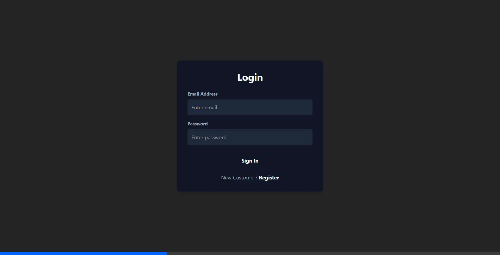
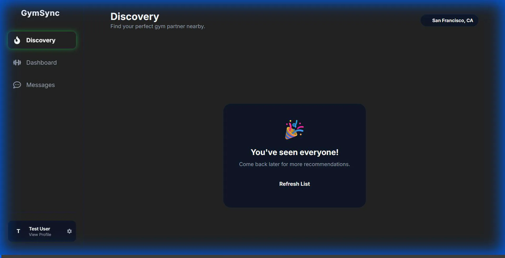

# Spottr (formerly Tinder Gym Buddies) 🏋️‍♂️💪

**Spottr** is a full-stack web application designed to help fitness enthusiasts find their perfect gym partner. Built with the MERN stack and enhanced with AI, it matches users based on fitness goals, location, and workout styles.



## 🚀 Features

-   **Smart Matchmaking**: Matches users based on city, fitness level, goals, and gym personality.
-   **Real-Time Chat**: Instant messaging with matches using Socket.io.
-   **AI-Powered Plans**: Personalized workout and diet plans generated by AI (OpenRouter).
-   **Gamification**: Earn XP, levels, and badges for consistency and interaction.
-   **Interactive Dashboard**: Track progress, compatibility, and community stats.
-   **Modern UI**: "Dark Neon" aesthetic with glassmorphism and smooth animations.

## 🛠️ Tech Stack

-   **Frontend**: React (Vite), TailwindCSS, Framer Motion, Axios
-   **Backend**: Node.js, Express.js, Socket.io
-   **Database**: MongoDB (Geospatial Indexing)
-   **AI**: OpenRouter API (Mistral/Llama)
-   **Deployment**: Render (Static Site + Web Service)

## 📸 Demo



## ⚙️ Prerequisites

-   Node.js (v18+)
-   MongoDB Atlas Connection String
-   OpenRouter API Key (for AI features)

## 📦 Installation & Setup

1.  **Clone the repository**
    ```bash
    git clone https://github.com/cout-arya/spottr.git
    cd spottr
    ```

2.  **Server Setup**
    ```bash
    cd server
    npm install
    ```
    Create a `.env` file in the `server` directory:
    ```env
    PORT=5000
    MONGO_URI=your_mongodb_connection_string
    JWT_SECRET=your_jwt_secret
    OPENROUTER_API_KEY=your_openrouter_key
    CLIENT_URL=http://localhost:5173 
    # Or your production URL
    ```

3.  **Client Setup**
    ```bash
    cd ../client
    npm install
    ```
    Create a `.env` file in the `client` directory:
    ```env
    VITE_API_URL=http://localhost:5000
    # Or your production backend URL
    ```

## 🏃‍♂️ Running Locally

1.  **Start the Server**
    ```bash
    cd server
    npm run dev
    ```

2.  **Start the Client**
    ```bash
    cd client
    npm run dev
    ```

Visit `http://localhost:5173` to see the app!

## 🧪 Test Users

Use these credentials to test the application logic and matchmaking:

| Name | Email | Password | Role/Style |
| :--- | :--- | :--- | :--- |
| **The Beast** | `beast@example.com` | `password123` | Hardcore Powerlifter |
| **Newbie Nancy** | `nancy@example.com` | `password123` | Beginner / Social |
| **CrossFit Chris** | `chris@example.com` | `password123` | CrossFit / Intensity |
| **Yogi Yasmin** | `yasmin@example.com` | `password123` | Yoga / Flexibility |
| **Balanced Bob** | `bob@example.com` | `password123` | General Fitness |

## 🌍 Deployment (Render)

### Backend (Web Service)
1.  Root Directory: `server`
2.  Build Command: `npm install`
3.  Start Command: `node index.js`
4.  Env Vars: Add `MONGO_URI`, `JWT_SECRET`, `OPENROUTER_API_KEY`.

### Frontend (Static Site)
1.  Root Directory: `client`
2.  Build Command: `npm install && npm run build`
3.  Publish Directory: `dist`
4.  Env Vars: `VITE_API_URL` = Your backend URL (e.g., `https://spottr-api.onrender.com`)
5.  **Important**: Ensure a `_redirects` file exists in `public/` with `/* /index.html 200` for routing.

---
*Built with ❤️ by Agent Antigravity*
