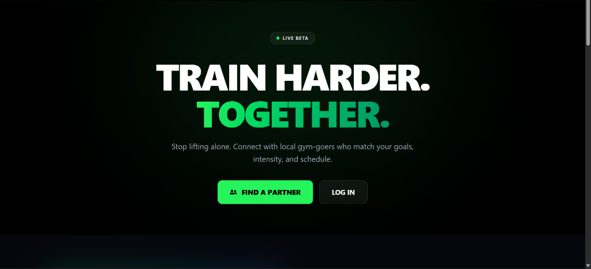
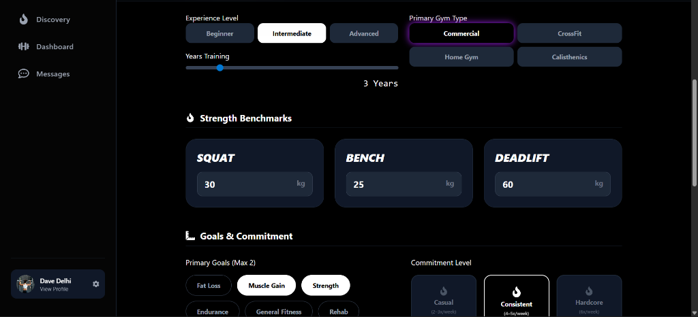
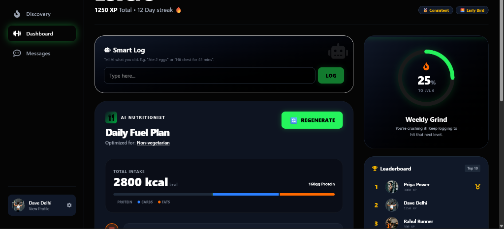
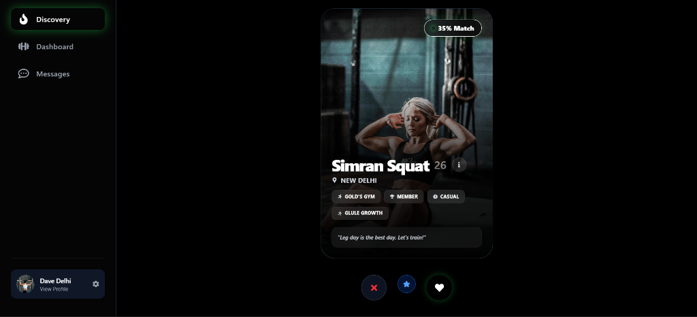

# Spottr - Gym Buddy Finder 🏋️‍♂️💪

**Spottr** is a modern social fitness application designed to help gym-goers find their perfect workout partner. Whether you need a spotter for heavy lifts, a running mate for cardio, or just someone to keep you accountable, Spottr connects you with local fitness enthusiasts who match your goals, schedule, and intensity.

## 🚀 Key Features

### 🤝 Smart Matching
Find partners based on:
- **Location**: Geolocation-based matching to find gym buddies nearby (e.g., in Delhi).
- **Gym Preference**: Filter by Commercial gyms, CrossFit boxes, or specialized studios.
- **Goals**: Match with users who share your focus (Muscle Gain, Strength, Endurance).
- **Experience Level**: Connect with Beginners, Intermediates, or Advanced athletes.

### 🥗 AI Nutritionist
Get a personalized daily fuel plan generated by AI based on your profile and goals.
- **Custom Macros**: Protein, Carbs, and Fats calculated for your body type.
- **Meal Suggestions**: Indian-friendly meal options (Vegetarian/Non-Veg).
- **Smart Adjustments**: Regenerate plans as your goals evolve.

### 🤖 Smart Activity Logging
Log your workouts and meals using natural language.
- **AI Parsing**: Just type "Ate 3 eggs and toast" or "Did 3 sets of squats", and the AI automatically categorizes it and awards XP.
- **Gamification**: Earn XP, level up, and maintain streaks to stay motivated.

### 🏆 Leaderboard & Gamification
- **Weekly Grind**: Track your progress against other users.
- **Badges**: Unlock achievements like "Early Bird", "Consistency King", and "Heavy Lifter".
- **Global Leaderboard**: Compete with the top fitness enthusiasts in your area.

---

## 📸 Application Walkthrough

### 1. Landing Page
The entry point to the Spottr ecosystem. A high-energy, dark-themed design that motivates users to "Train Harder, Together".

### 2. Profile Setup
Create your detailed fitness identity. Set your gym type, experience level, strength benchmarks (Squat/Bench/Deadlift), and primary goals. This data powers the matching algorithm.

### 3. Dashboard
Your fitness command center.
- **Stats**: View your current Level, XP, and Streak.
- **Smart Log**: The AI-powered input field for tracking activities.
- **AI Nutritionist**: View your daily meal plan with macro breakdown.
- **Leaderboard**: See where you stand among the top athletes.

### 4. Discovery (Matching)
Swipe through potential gym buddies. View tailored cards showing their stats, bio, and match percentage.
- **Match Score**: See how well a user aligns with your goals.
- **Quick Actions**: Like, Pass, or Super Like.

### 5. Chat & Connections
Once matched, coordinate your workouts instantly. Real-time messaging allows you to plan sessions, discuss routines, or just hype each other up.

---

## 🛠️ Tech Stack
- **Frontend**: React, Tailwind CSS, Framer Motion
- **Backend**: Node.js, Express, MongoDB
- **AI**: Gemini/OpenAI Integration for Diet Plans & Smart Logging
- **Real-time**: Socket.io for Chat

## 🧪 Test Data (Delhi Demo)
The application is pre-seeded with test users in **New Delhi** for demonstration:
- **Dave Delhi**: Your main demo account.
- **Priya Power, Rahul Runner, Amit Abs**: Sample matches with varying profiles.
- **Pre-filled Data**: existing chats, matches, and activity logs to showcase the UI.

## 🏃‍♂️ Getting Started
1. Clone the repository.
2. Install dependencies: `npm install` (root, client, server).
3. Set up `.env` with MongoDB URI and API keys.
4. Run `npm run dev` to start both client and server.
5. Visit `http://localhost:5173`.
