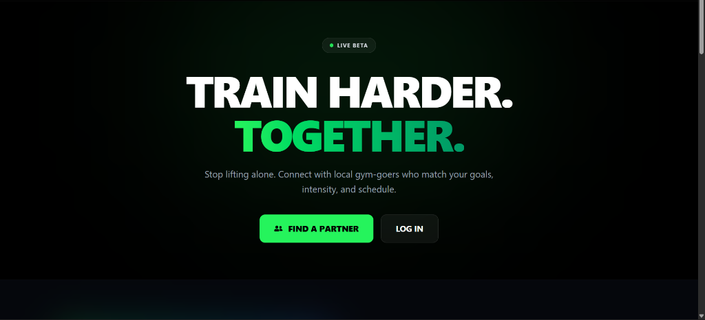
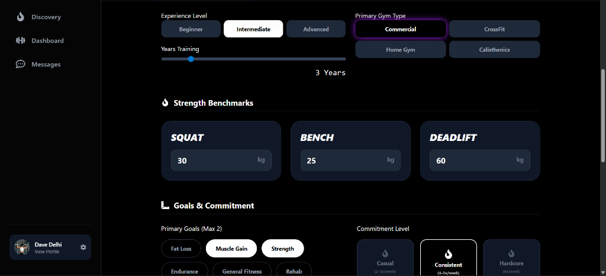
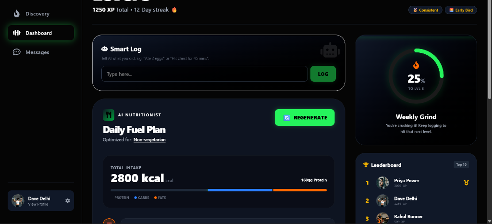
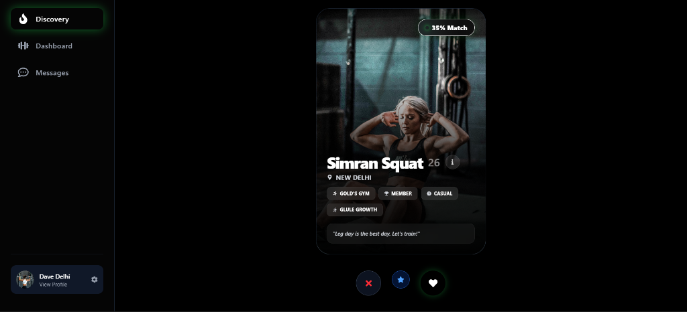
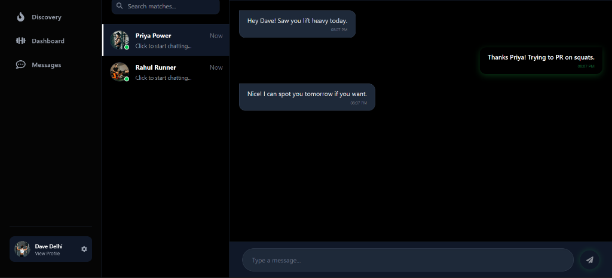

# Spottr: AI-Powered Social Fitness Platform
## Comprehensive Project Documentation
**Date:** February 6, 2026

---

## 1. Executive Summary

**Spottr** is a modern social fitness application designed to connect gym-goers with their perfect workout partners. By leveraging advanced matching algorithms and AI-powered nutrition planning, Spottr solves the problems of workout accountability and personalized fueling.

The platform combines the social discovery aspects of dating apps with the utility of fitness tracking, enhanced by a cutting-edge Retrieval-Augmented Generation (RAG) AI system for grounded nutritional advice.

---

## 2. Key Features

### 🤝 Smart Matching System
Connects users based on a multi-factor compatibility score:
- **Location**: Geolocation-based matching (< 5km priority).
- **Gym Preference**: Commercial vs. CrossFit vs. Home Gym.
- **Goals**: Muscle Gain, Fat Loss, Strength, Endurance.
- **Experience Level**: Beginner to Advanced matching.
- **Algorithm**: `Score = (Goals × 25%) + (Schedule × 20%) + (Level × 15%) + (Others × 40%)`.

### 🥗 RAG-Powered AI Nutritionist
Generates highly personalized diet plans grounded in verified science.
- **RAG Architecture**: Retrieves context from a vector database of 30+ nutrition guidelines before generating plans.
- **Per-Meal Regeneration**: Users can regenerate specific meals (e.g., "Change Breakfast") without altering the rest of the plan.
- **Smart Variety**: Ensures menu diversity (e.g., rotating between Eggs, Parathas, South Indian items).
- **Multi-Model Intelligence**: Automatically falls back from **Gemini Flash 2.0** to **Llama 3.3** for reliability.

### 🤖 Smart Activity Logging
Natural language processing for workout tracking.
- **Input**: "Ate 3 eggs and did 5x5 squats"
- **Output**: Automatically logs protein/calories and awards XP for the workout.

### 🏆 Gamification
- **Leaderboards**: Weekly competitions based on XP.
- **Streaks**: Daily consistency tracking.
- **Badges**: Achievements for milestones (e.g., "Early Bird").

---

## 3. Application Walkthrough

### Landing Page
The entry point features a high-energy, dark-themed design enticing users to "Train Harder, Together".


### Profile Setup
Users build their fitness identity, setting benchmarks (Squat/Bench/Deadlift) and preferences. This data fuels the matching algorithm.


### Dashboard Command Center
The central hub showing:
- **AI Diet Plan**: With regeneration options.
- **Smart Log**: AI input field.
- **Leaderboard**: Global rankings.


### Discovery & Matching
Swipe interface to find partners. Cards display match compatibility scores and shared goals.


### Real-Time Chat
Instant messaging with matched users to coordinate workouts and share motivation.


---

## 4. Technical Architecture

### Tech Stack
- **Frontend**: React.js, Tailwind CSS, Framer Motion (Animations)
- **Backend**: Node.js, Express.js
- **Database**: MongoDB (Data), JSON-based Vector Store (Embeddings)
- **AI/ML**: 
  - **OpenRouter**: Access to Gemini 2.0 Flash / Llama 3.3 70B
  - **Vector Search**: Cosine similarity for RAG context retrieval
- **Real-Time**: Socket.io for Chat and Notifications

### RAG System Flow
1. **User Request**: "Generate Muscle Gain Plan"
2. **Retrieval**: System queries vector DB for "Muscle Gain Nutrition"
3. **Context**: Retrieves verified chunks (e.g., protein targets, food sources)
4. **Generation**: Injects context into LLM prompt
5. **Output**: Grounded, scientifically accurate diet plan

---

## 5. Recent Enhancements (Feb 2026)

### System Stability (v1.2)
- Implemented **Auto-Fallback Logic**: If Gemini AI is busy, the system automatically switches to Llama 3.3 to prevent service outages.
- **Process Management**: Enhanced server startup scripts to auto-kill stale processes, resolving port conflicts.

### Per-Meal Regeneration (v1.1)
- Added dedicated API endpoints for regenerating single meals.
- Refined prompt engineering to drastically improve meal variety, specifically targeting Indian breakfast options to avoid repetitive suggestions.

---

## 6. Setup & Deployment

1. **Clone Repository**
   ```bash
   git clone [repo-url]
   ```
2. **Install Dependencies**
   ```bash
   npm install      # Root
   cd client && npm install
   cd server && npm install
   ```
3. **Environment Setup**
   Configure `.env` with `MONGO_URI`, `OPENROUTER_API_KEY`, `JWT_SECRET`.
4. **Run Application**
   ```bash
   # From root
   npm run dev
   ```
   - Frontend: `http://localhost:3000`
   - Backend: `http://localhost:5000`

---
*Generated by Antigravity AI Assistant*
